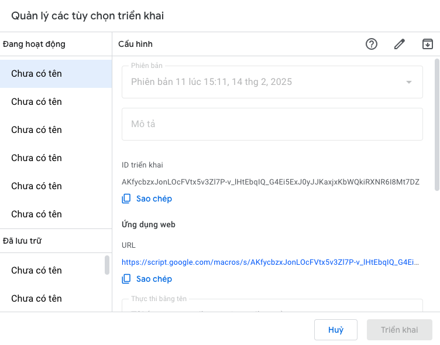
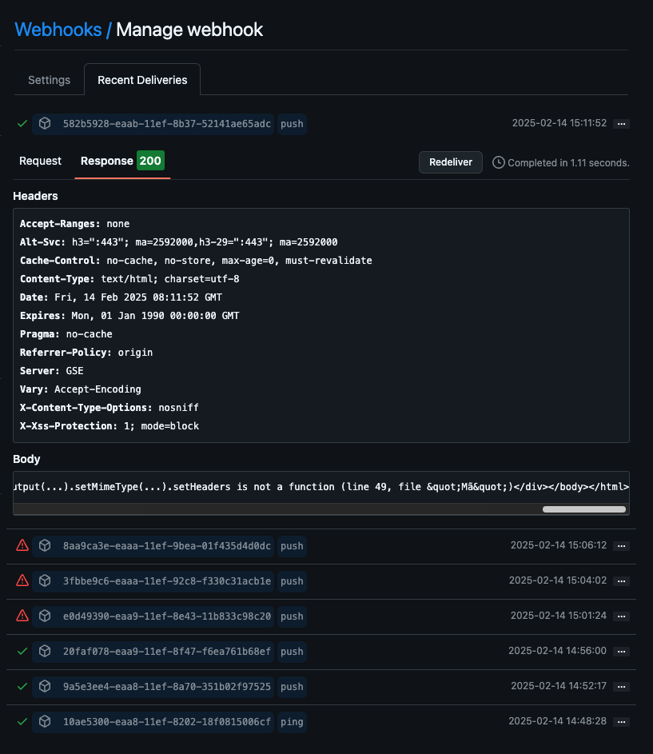

# Auto Update Google Docs from Git Commits

Hệ thống tự động cập nhật Google Docs khi có commit mới trên GitHub repository.

## Cài đặt

### 1. Tạo Google Doc và Google Apps Script

1. Tạo một Google Doc mới
2. Copy ID của Doc từ URL (phần giữa /d/ và /edit)
3. Truy cập https://script.google.com
4. Tạo project mới
5. Copy code Code.gs vào editor

### 2. Deploy Apps Script

1. Click "Deploy" > "New deployment"
2. Chọn "Web app"
3. Cấu hình:
   - Execute as: "Me"
   - Who has access: "Anyone"
4. Click "Deploy"
5. Authorize các quyền cần thiết
6. Copy URL web app được cung cấp

### 3. Cấu hình GitHub Webhook

1. Vào repository > Settings > Webhooks
2. Click "Add webhook"
3. Điền thông tin:
   - Payload URL: URL của Apps Script web app
   - Content type: application/json
   - Secret: generateRandomString
   - SSL verification: Enable
   - Events: Just the push event
4. Click "Add webhook"

### 4. Cấu hình Google Doc

1. Mở Google Doc đã tạo
2. Click Share
3. Thêm tài khoản Google của bạn với quyền Editor

## Sử dụng

Sau khi cài đặt, mỗi khi có commit mới vào repository:
- Webhook sẽ tự động gửi thông tin đến Apps Script
- Apps Script sẽ cập nhật Google Doc với thông tin commit:
  - Tên repository
  - Tên người commit
  - Nội dung commit message
  - Thời gian commit
  - Các file đã được sửa đổi

## Xử lý lỗi

Nếu không thấy cập nhật trong Google Doc:
1. Kiểm tra webhook deliveries trong GitHub
2. Kiểm tra URL của Apps Script trong webhook settings
3. Kiểm tra quyền truy cập của Google Doc
4. Kiểm tra logs trong Apps Script editor

## Bảo mật

- Webhook secret được sử dụng để bảo mật kết nối
- Google Doc chỉ được chia sẻ với các tài khoản được chỉ định
- Apps Script chạy với quyền của người tạo

## Đóng góp

Mọi đóng góp đều được chào đón. Vui lòng tạo issue hoặc pull request.

## Kết quả

